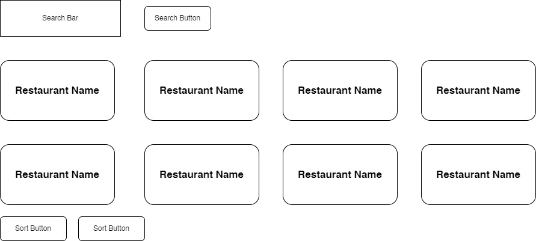
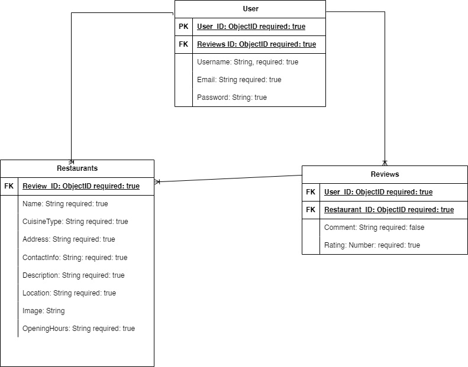

# Restaurant Guide

Welcome to the Restaurant Guide project! This is a simple web application where users can browse a list of restaurants, view details about each restaurant, and leave reviews.

## Features

- **Restaurant Listings:** View a list of restaurants with basic information such as name, cuisine type, and location.
- **Restaurant Details:** Click on a restaurant to view additional information such as address, contact information, opening hours, and a brief description.
- **Reviews:** Leave reviews for restaurants, including a rating (out of 5 stars) and a comment.
- **Search and Filter:** Search for restaurants by name or cuisine type, and filter search results by location or price range.
- **User Authentication:** Sign up, log in, and log out to access additional features like saving favorite restaurants or managing your own reviews.

## Tech Stack

- **Frontend:** HTML, CSS, JavaScript
- **Backend:** Node.js, Express.js, Axios
- **Database:** MongoDB

